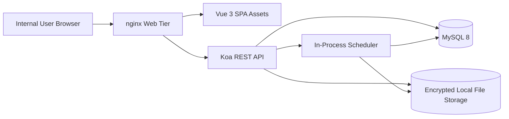
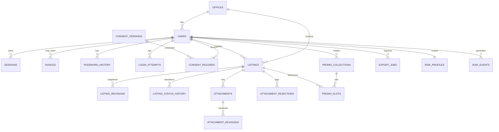
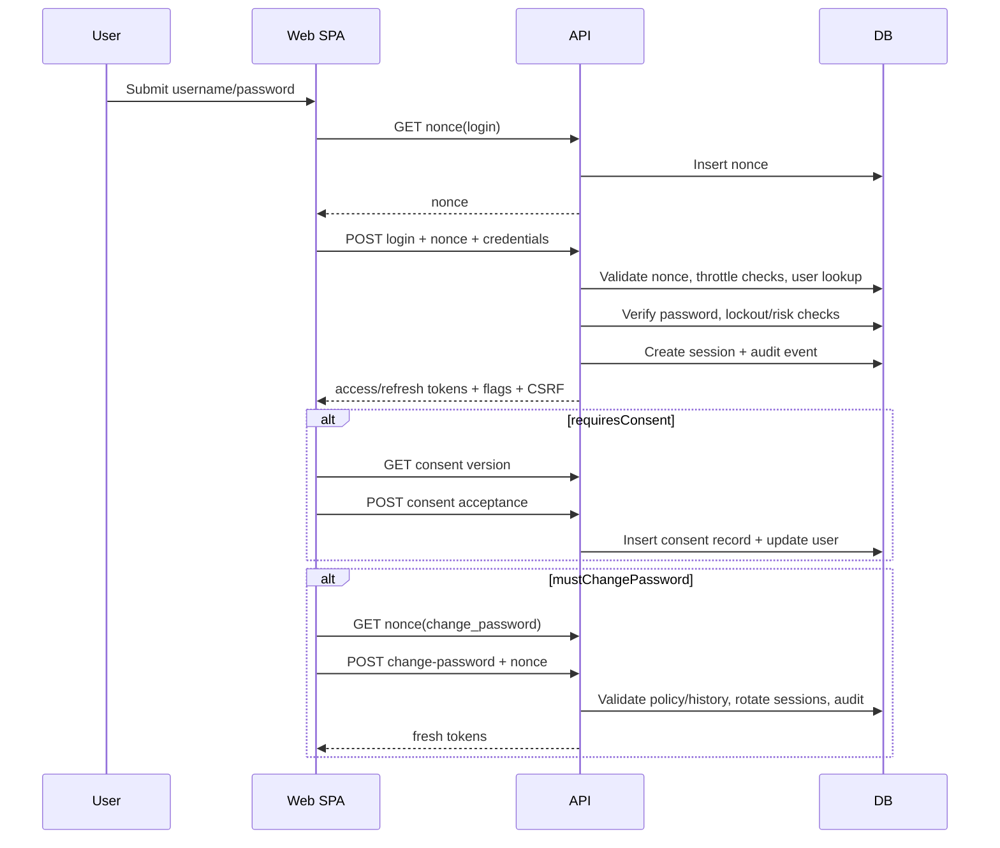
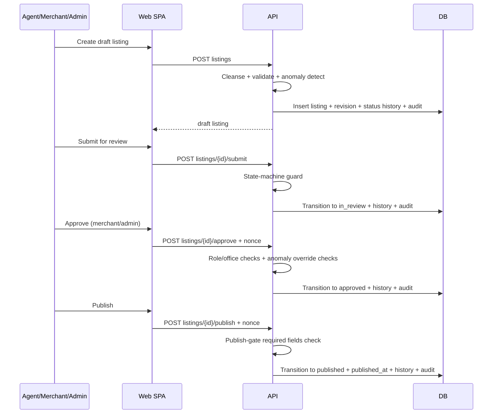
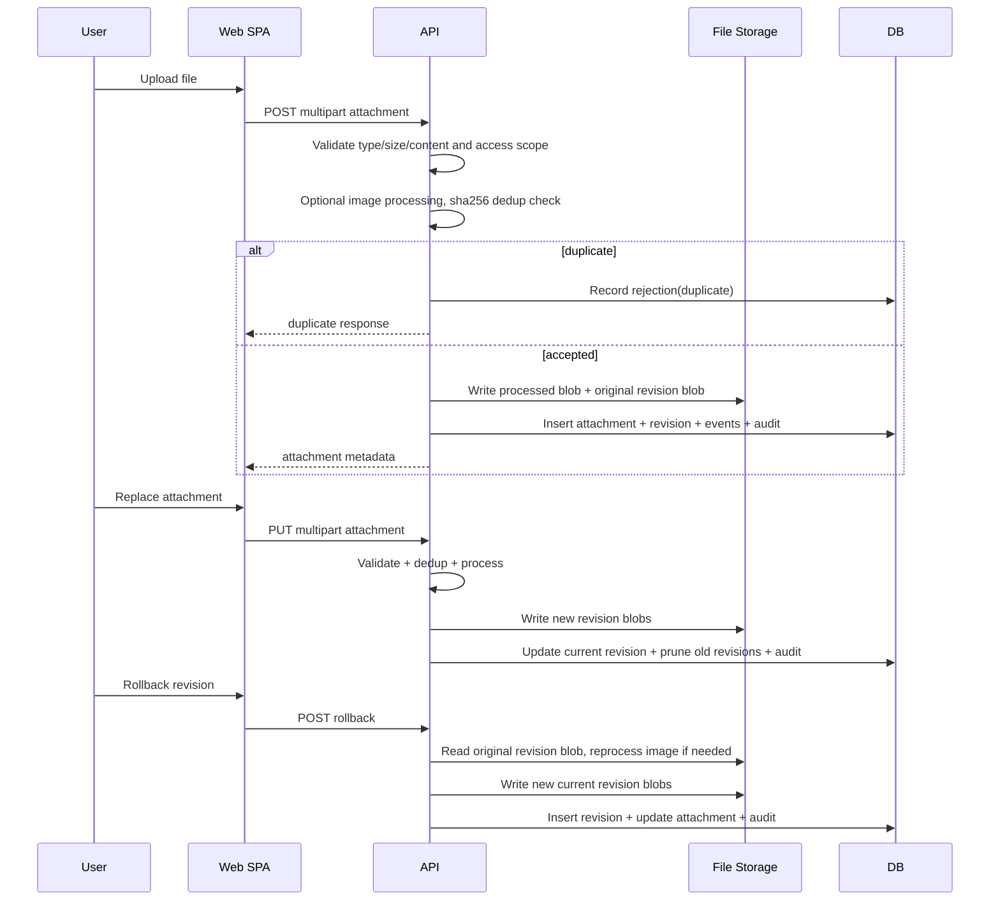
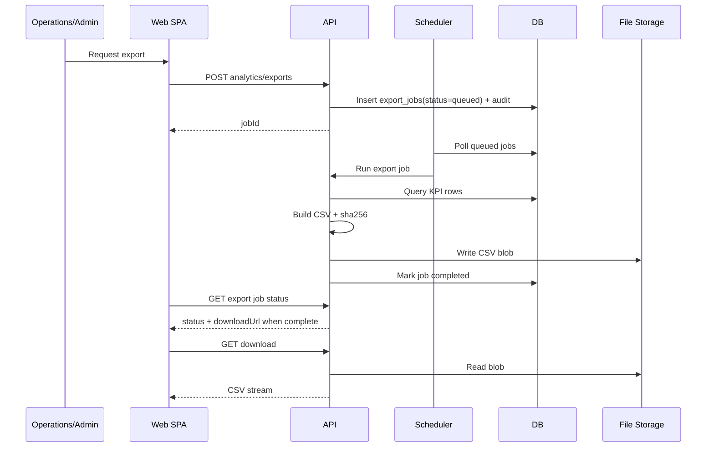
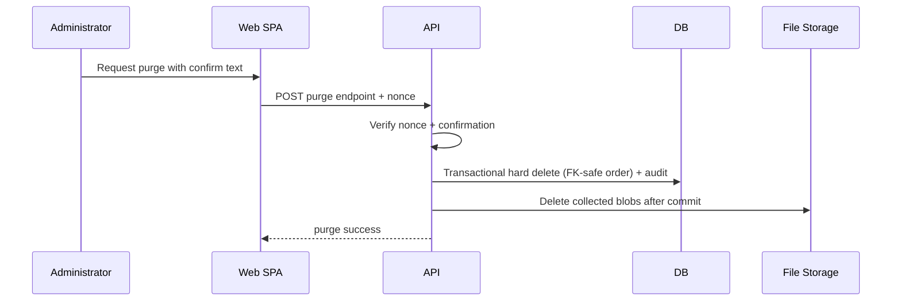

# HarborStone Listings Operations Suite - System Design

Generated on 2026-04-16

## Table of Contents

1. System Overview
2. High-Level Architecture
3. Frontend Design
4. Backend Design
5. Database Design
6. Data Flow
7. Integration Points
8. Non-Functional Requirements
9. Deployment and Infrastructure
10. Design Decisions and Trade-offs
11. Assumptions

## 1. System Overview

HarborStone Listings Operations Suite is a full-stack internal operations platform for brokerage teams to:

- Manage authentication, consent, and role-based access.
- Author and review listings through controlled workflow states.
- Upload and manage listing attachments with validation, deduplication, and revision history.
- Curate promotional collections.
- Track KPI analytics and generate downloadable CSV exports.
- Enforce risk policies and maintain a tamper-evident audit trail.

Architecture style:

- Modular monolith (single backend service with domain modules).
- Single SPA frontend served via nginx.
- Single relational database (MySQL).
- Background processing implemented as in-process scheduler plus DB job records.

## 2. High-Level Architecture

### 2.1 System Context



### 2.2 Runtime Topology

- Web tier:
  - nginx serves static frontend assets.
  - Proxies all /api requests to backend.
  - Supports HTTPS by default with auto-generated local certificate (or mounted certs).
- Backend tier:
  - Koa application running TypeScript via ts-node in container.
  - Runs migrations and seeds at startup.
  - Starts periodic scheduler loop.
- Data tier:
  - MySQL 8 as source of truth for all transactional data.
  - Local attachment/export filesystem volume with envelope encryption.

### 2.3 Major Components and Interactions

- Frontend:
  - Vue SPA for all user-facing workflows.
  - Uses role-aware navigation and route guards.
- Backend:
  - REST endpoints grouped by domain (auth, listings, attachments, promo, analytics, admin, users, offices).
  - Middleware stack enforces error envelope, throttling, CSRF, idempotency, and route-level auth.
- Database:
  - Domain-centric schema with FK constraints and indexes.
  - Stores session/auth artifacts, listing/attachment state, analytics rollups, and job tracking.
- Infrastructure services:
  - In-memory request-rate counters.
  - File storage abstraction backed by encrypted local filesystem.
  - Scheduler for rollups, retention, export processing, risk decay, and audit verification.
- External tools/libraries:
  - sharp for image normalization.
  - ffprobe (ffmpeg) for video codec validation.

## 3. Frontend Design

### 3.1 Framework and Libraries

- Vue 3 with Composition API.
- Vite build pipeline.
- Pinia for state management.
- Vue Router for client routing.
- Axios for API communication.
- IndexedDB (idb) for offline mutation outbox.
- Chart.js and vue-chartjs for analytics visualization.

### 3.2 Component Structure and Hierarchy

High-level UI hierarchy:

```text
App
  RouterView (page)
  ToastContainer

Page views (examples)
  LoginView
  ListingsView
  ListingDetailView
  AttachmentsView
  PromoView / PromoDetailView
  AnalyticsView
  AdminView

Shared layout
  AppShell
    Sidebar
    TopBar
```

Feature-oriented component groups:

- auth: consent modal, change-password modal, offline captcha.
- listings: status badges, workflow action controls.
- attachments: uploader/list/revision interactions.
- analytics: KPI cards, funnel chart, export panel.
- promo: form/status/slot management UI elements.
- common: modal, confirm dialog, spinner, empty-state, toasts.

### 3.3 State Management Approach

- Auth store:
  - user profile, access token, refresh token, consent and forced-password-change flags.
  - persisted in localStorage.
- Offline store:
  - outbox entries persisted in IndexedDB.
  - tracks pending/failed operations, retry metadata, connectivity state.

### 3.4 Routing Strategy

- History mode routing.
- Route-level meta for public vs protected pages and role requirements.
- Global navigation guard enforces:
  - authenticated access.
  - role-based route access.
  - forced password-change flow gate.

### 3.5 API Communication Layer

Axios client applies cross-cutting request/response behaviors:

- Request:
  - Adds bearer token when authenticated.
  - Adds device fingerprint header.
  - Adds CSRF token for mutating requests.
  - Adds UUIDv4 idempotency key for mutating requests.
- Response:
  - Captures CSRF token from response headers.
  - Handles 401 by refreshing token and replaying queued requests.
  - Converts network failures on eligible mutating requests into offline queued operations.

### 3.6 Key UI/UX Patterns

- Role-aware navigation and actions.
- Cursor-based list pagination with filter bars.
- Optimistic workflow controls with toast feedback.
- Dedicated offline behavior:
  - pending mutation badge in top bar.
  - reconnect-triggered replay.
  - exponential retry and terminal-failure state.

## 4. Backend Design

### 4.1 Framework and Structure

- Koa + koa-router REST API.
- Domain modules organized by:
  - routes (transport/controller layer).
  - services (business/domain logic).
  - middleware (cross-cutting policies).
  - db migrations/seeds (schema + bootstrap data).
  - jobs (scheduler and retention workers).
  - audit (hash-chain integrity).
  - storage (repository abstraction and encryption).

### 4.2 Request Processing Pipeline

Middleware order:

1. Error middleware (normalized error envelopes and logging).
2. IP rate limiting middleware.
3. JSON body parser.
4. CSRF middleware.
5. Idempotency middleware.
6. Route handlers.

This ordering ensures:

- Errors are captured uniformly.
- Abuse controls are evaluated early.
- CSRF and idempotency apply to mutating calls before business logic.

### 4.3 API Design Principles

- REST only.
- Consistent response envelope:
  - success: ok=true + data.
  - failure: ok=false + error(code, message, details).
- Cursor pagination for large list endpoints.
- Optimistic concurrency for listing updates via If-Match version header.
- Explicit state transition endpoints for workflow actions.

### 4.4 Authentication and Authorization

Authentication:

- JWT access and refresh tokens using HS256.
- Session-backed token lifecycle (JTI stored in DB sessions table).
- Device-fingerprint binding for refresh path.

Authorization:

- Role-based policy checks (regular_user, merchant, operations, administrator).
- Office-scoped checks for merchant permissions.
- Consent-gated endpoints via dedicated middleware.
- Sensitive operations require actor-bound nonce (publish/approve/role change/purge/password change).

### 4.5 Business Logic Organization

Representative service domains:

- listing:
  - data cleansing/normalization.
  - anomaly flagging.
  - state-machine transitions.
  - revision/history tracking.
- attachment:
  - server-authoritative validation.
  - deduplication by listing scope and sha256.
  - revision retention/pruning and rollback.
- promo:
  - lifecycle transitions and status computation.
  - slot constraints and ordering.
- analytics/export:
  - KPI rollups and funnel calculations.
  - async CSV export jobs with retry.
- risk:
  - penalties, decay, threshold actions.
  - blacklist management.
- audit:
  - append-only, hash-chained tamper evidence.

### 4.6 Background Jobs and Async Processing

Scheduler runs every 60 seconds and records executions in job_runs.

Implemented recurring/background tasks:

- Daily KPI rollup.
- Monthly KPI rollup.
- Listing retention hard purge.
- Audit log compaction.
- Export expiration cleanup.
- Audit-chain integrity verification.
- Risk score decay.
- Attachment orphan-blob sweep.
- Search index maintenance.
- Export queue processing (batched).

## 5. Database Design

### 5.1 Database Type and Core Characteristics

- MySQL 8, InnoDB engine.
- UTF8MB4 character set/collation.
- Knex-managed schema migrations and seeds.

### 5.2 Schema by Domain

Identity and security:

- users
- sessions
- nonces
- idempotency_keys
- password_history
- login_attempts
- consent_versions
- consent_records

Organization:

- offices

Listings:

- listings
- listing_revisions
- listing_status_history

Attachments:

- attachments
- attachment_revisions
- attachment_rejections

Promotions:

- promo_collections
- promo_slots

Analytics and exports:

- event_log
- kpi_daily
- kpi_monthly
- export_jobs

Risk and governance:

- risk_profiles
- risk_events
- blacklist_entries
- audit_log
- job_runs
- settings

### 5.3 Relationship Model



### 5.4 Indexing Strategy

Representative indexing choices:

- listings:
  - office_id, status, created_by, published_at, updated_at, soft_deleted_at.
  - FULLTEXT index on address_line, city, layout_normalized.
- revisions/history tables:
  - listing_revisions(listing_id).
  - listing_status_history(listing_id, created_at).
  - event_log on user_id, event_type, entity tuple, office_id, created_at.
- attachment lookup/dedup:
  - attachments(listing_id).
  - attachments(listing_id, sha256).
  - attachment_revisions(attachment_id).
- analytics tables:
  - unique composite keys for KPI grains and dimensions.
  - date and office indexes.
- operations tables:
  - export_jobs status/expires/requestor indexes.
  - job_runs job/status/time indexes.

### 5.5 Migration Approach

- Forward-only timestamped migrations with explicit up/down functions.
- App startup automatically executes latest migrations and then seeds.
- Seeds are idempotent and establish:
  - default settings.
  - default consent version.
  - default office and bootstrap users.

## 6. Data Flow

### 6.1 Login, Consent, and Password Change



### 6.2 Listing Lifecycle (Create to Publish)



### 6.3 Attachment Upload, Revision, and Rollback



### 6.4 Analytics Export Queue and Download



### 6.5 Admin Purge



## 7. Integration Points

### 7.1 Third-Party and Platform Integrations

- MySQL 8 database.
- nginx reverse proxy and static web serving.
- sharp image-processing library.
- ffprobe from ffmpeg for video codec validation.
- file-type for MIME sniffing with magic-byte fallback.
- local filesystem volumes for attachments and exports.

No external internet APIs are required at runtime.

### 7.2 How Integrations Are Used

- sharp:
  - EXIF-aware rotate, metadata stripping, resize, output re-encode.
- ffprobe:
  - validates MP4 codec requirements for uploaded videos.
- nginx:
  - request routing, upload size/timeouts, static caching, TLS termination.
- storage layer:
  - encrypted repository abstraction for blobs.

### 7.3 Failure Handling and Retries

- Export processing:
  - retries with exponential backoff (30s, 2m, 10m), then terminal failed status.
- Frontend offline outbox:
  - retries queued mutations with progressive delay; non-retryable HTTP classes fail terminally.
- Blob cleanup:
  - orphan sweep and retention jobs tolerate per-key deletion failures and continue.
- Scheduler:
  - failures captured in job_runs, does not crash API service loop.

## 8. Non-Functional Requirements

### 8.1 Scalability Strategy

- Modular monolith keeps coordination simple for single-tenant installs.
- Cursor pagination and bounded list limits reduce read amplification.
- Background scheduler offloads expensive periodic work.
- Indexed DB operations and maintenance indexes improve query performance.

### 8.2 Performance Considerations

- FULLTEXT search for listing query term matching.
- Daily/monthly KPI rollups avoid expensive on-demand aggregation for dashboards.
- Gzip and immutable static asset caching at nginx tier.
- Attachment processing pipelines constrained with explicit size/type limits.

### 8.3 Security Practices

- JWT + DB session validation for every authenticated request.
- CSRF protection for authenticated mutating API requests.
- Idempotency enforcement for mutating operations.
- Password policy and history enforcement.
- Account lockout, brute-force throttles, optional CAPTCHA.
- Role + office-scoped authorization.
- Nonce-based protection for sensitive actions.
- Encrypted file storage with per-file DEK and KEK wrapping.
- Structured logging with sensitive-field redaction.

### 8.4 Reliability and Fault Tolerance

- Soft-delete strategy with timed retention and restore windows for listings.
- Hash-chained audit log for tamper evidence.
- Scheduled chain verification.
- Retention jobs for lifecycle cleanup.
- Graceful process shutdown handling.

### 8.5 Logging and Monitoring

- Pino structured logs with configurable verbosity.
- Health endpoint includes app status and current audit chain head hash.
- job_runs table provides operational visibility into scheduler tasks.
- event_log and audit_log provide business and security observability.

## 9. Deployment and Infrastructure

### 9.1 Hosting Environment

Containerized deployment via Docker Compose:

- db: MySQL 8.
- api: Node 20 Koa app.
- web: nginx serving SPA and proxying API.

Volumes:

- db_data for MySQL persistence.
- attachments for encrypted blob storage.

### 9.2 CI/CD Pipeline

Continuous integration workflow executes:

- API typecheck, tests, and build.
- Web typecheck, tests, and build.
- Optional Playwright E2E via manual workflow trigger.

Local integrated verification script runs:

- backend tests.
- frontend typecheck.
- frontend unit tests.
- full-stack Playwright E2E (default, opt-out).

### 9.3 Environment Configuration

Primary runtime configuration via environment variables:

- DB connection settings.
- JWT secret and security tuning.
- bcrypt cost.
- logging level.
- timezone.
- storage paths.
- seed user passwords.

Runtime settings table stores mutable policy controls (lockout thresholds, anomaly thresholds, etc.).

### 9.4 Secrets Management

Current model:

- Secrets supplied through environment variables in container runtime.
- Storage KEK can be explicitly provided, with fallback derivation from JWT secret.

Operational recommendation:

- Always set explicit strong JWT_SECRET and STORAGE_KEK in production.
- Do not rely on fallback defaults outside local development.

## 10. Design Decisions and Trade-offs

| Decision | Selected Approach | Alternative | Trade-off |
|---|---|---|---|
| Service architecture | Modular monolith | Microservices | Faster delivery and simpler ops vs reduced independent scaling/deployment granularity |
| API style | REST | GraphQL/RPC | Simpler contracts and middleware reuse vs less flexible client-driven querying |
| Auth model | JWT + DB-backed sessions | Stateless JWT-only or external IdP | Better revocation/control vs DB lookup overhead and tighter coupling |
| Queueing model | DB-backed scheduler/jobs | Redis/BullMQ | Fewer moving parts for offline/single-host installs vs lower throughput and less queue feature depth |
| Blob storage | Encrypted local filesystem | S3-compatible object storage | Offline-friendly and simple deployment vs weaker horizontal scaling and remote durability |
| Listing search | MySQL FULLTEXT + filters | Dedicated search engine | Operational simplicity vs fewer advanced search capabilities |
| Audit integrity | Hash-chained append log | Plain append-only log | Strong tamper evidence vs additional write/verify complexity |
| Offline resilience | Client-side IndexedDB outbox | Server-side deferred command queue | Better UX in disconnected clients vs complex replay/error semantics on client |
| Workflow enforcement | Explicit state-machine services | Ad-hoc route checks | Centralized transition rules vs extra indirection in service layer |
| Security controls | CSRF + idempotency + nonce layering | Single mechanism only | Defense in depth vs increased implementation complexity |

## 11. Assumptions

- Assumption: Deployment target is primarily single-host or LAN-oriented; no Kubernetes manifests or autoscaling orchestration are implemented.
- Assumption: Separate staging environment topology is not explicitly codified; current delivery targets development and production-like Compose usage.
- Assumption: Centralized metrics stack (for example Prometheus/Grafana) is not implemented; observability relies on logs, DB tables, and health checks.
- Assumption: No external identity provider integration is required; local user/password identity is authoritative.
- Assumption: No external message broker is required; current async workloads are within acceptable limits for DB-backed scheduling.